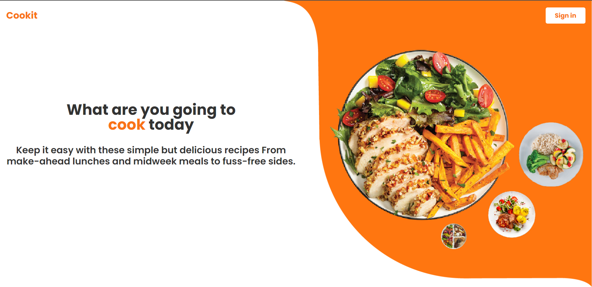
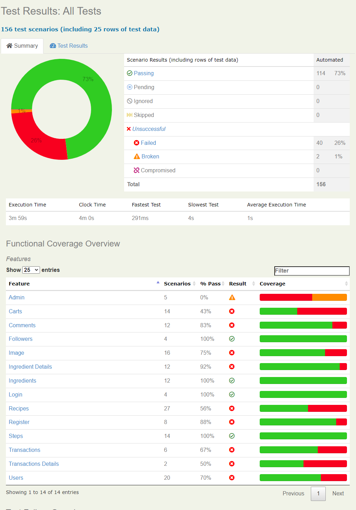

<div align="center">
<br/>
<summary><h1 style="display-inline:block">Cookit</h1></summary>
Capstone Program Immersive Alterra Academy <br/>
<a href="https://docs.google.com/spreadsheets/d/1W5eeFWLqsoTH5vHfJM3Cjy0MyJ4OC26zt6oE6zSUqMc/edit#gid=206023564" target="blank"></a>
<a href="" target="blank"></a>
<a href="https://app.swaggerhub.com/apis-docs/STARCON10_1/ALTA-Cookit-BE/1.0#/" target="blank"></a>


</div>

## About Cookit 🍪
Cookit is a web-based application that is useful for uploading, sharing and selling food recipes around the world. In Cookit we can also like other people's posts and recipes, comment on them and also re-cook to show off your own version of the work. We can also follow the people we want. Cookit also has a feature to sell recipes that we have made before. Looks fun, right? Let's join thousands of users on Cookit right now to upload your own recipes and sell them around the world!

## Collaboration 🧑‍💻
- 🔎 [Automation API](https://github.com/ALTA-QE12-TeamA-Cookit/ALTA-QE12-TeamA-Cookit-APITest)
- 🔎 [Automation Web](https://github.com/ALTA-QE12-TeamA-Cookit/ALTA-QE12-TeamA-Cookit-WebTest)


## API AUTOMATION REPORT ⚒️
<div align="center">
<br/>
</div>


## Tools ⚙️
<div>
<p>Manual Testing</p>
      <a></a>
      <p>Test Case Management</p>
      <a></a>
      <p>Automation Testing</p>
      
      
      
      
      
      
      
      <p>Management Project</p>
      
</div>

## Team Cookit Quality Assurance Engineer 👨‍💻 :
* [Alfian Aditya](https://github.com/alfianadityads) <br> [](https://github.com/alfianadityads)
* [Arif Laksonodhewo](https://github.com/OOOOAAAAEEEEEE) <br> [](https://github.com/OOOOAAAAEEEEEE)
* [Ilham Muchsinin](https://github.com/Ilhm0) <br> [](https://github.com/Ilhm0)

## How to Run This Project:
- Clone it

```
$ git clone https://github.com/ALTA-QE12-TeamA-Cookit/ALTA-QE12-TeamA-Cookit-APITest.git
```

- Go to directory

```
$ cd ALTA-QE12-TeamA-Cookit-APITest
```

- Run the project

```
$ mvn clean verify
```

- Voila! 🪄

 <p align="right">(<a href="#top">back to top</a>)</p>
<h3>
<p align="center">Built with ❤️ by Cookit QA Team</p>
<p align="center">©️ Oct 2023 </p>
</h3>